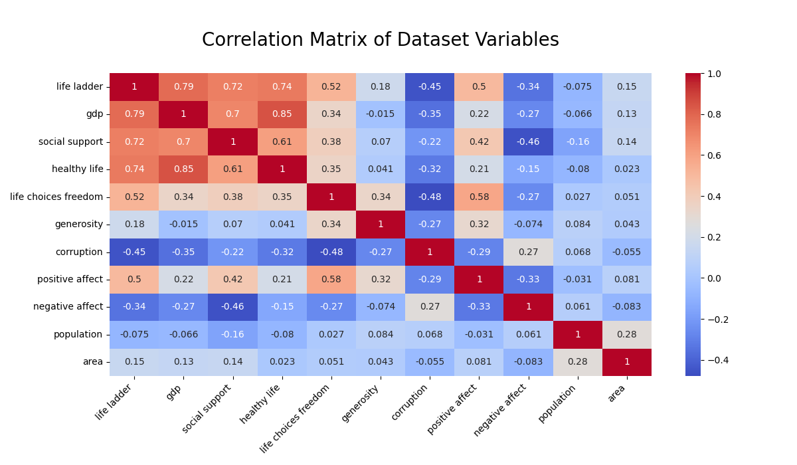
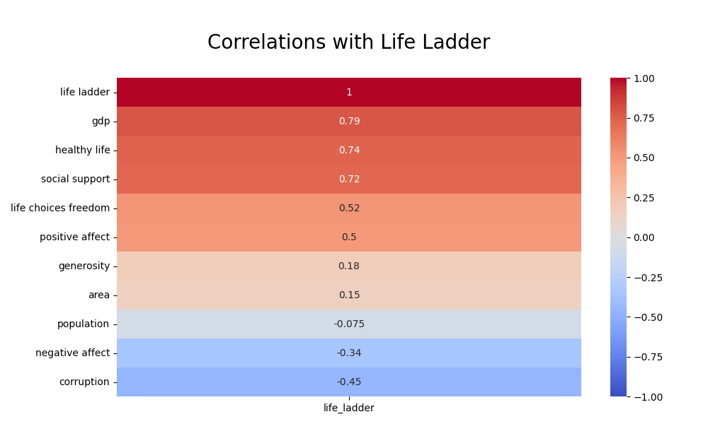
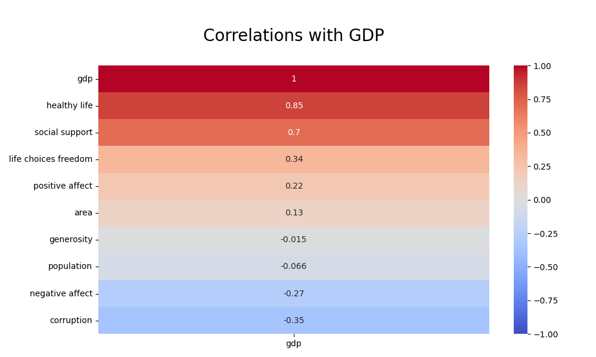
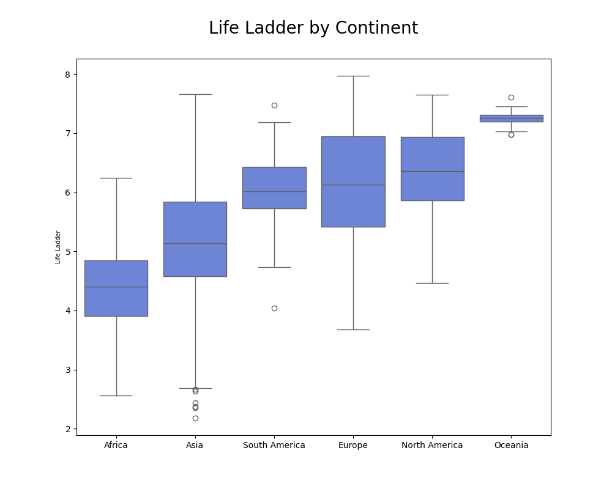

# World Happiness Data Analysis
"Happiness is a fundamental human goal. The United Nations General Assembly recognizes this goal
and calls for “a more inclusive, equitable and balanced approach to economic growth that 
promotes the happiness and well-being of all peoples.”"  
https://www.un.org/en/observances/happiness-day

### Research question
What variables affect happiness score (life ladder variable).  
[Variable definitions](variable_definitions.txt)  

[Basic data insight before preprocessing data](insight/basic_insight.txt)  
[Basic data insight after preprocessing data](insight/basic_insight_clean_data.txt)  
[Exploratory analysis](exploratory_data_analysis.md)
--------------------------------------------  

  
  

### Data Source:
World Happiness Report 2024  
https://worldhappiness.report/data/  

### IDE
PyCharm 2023.2.1  

