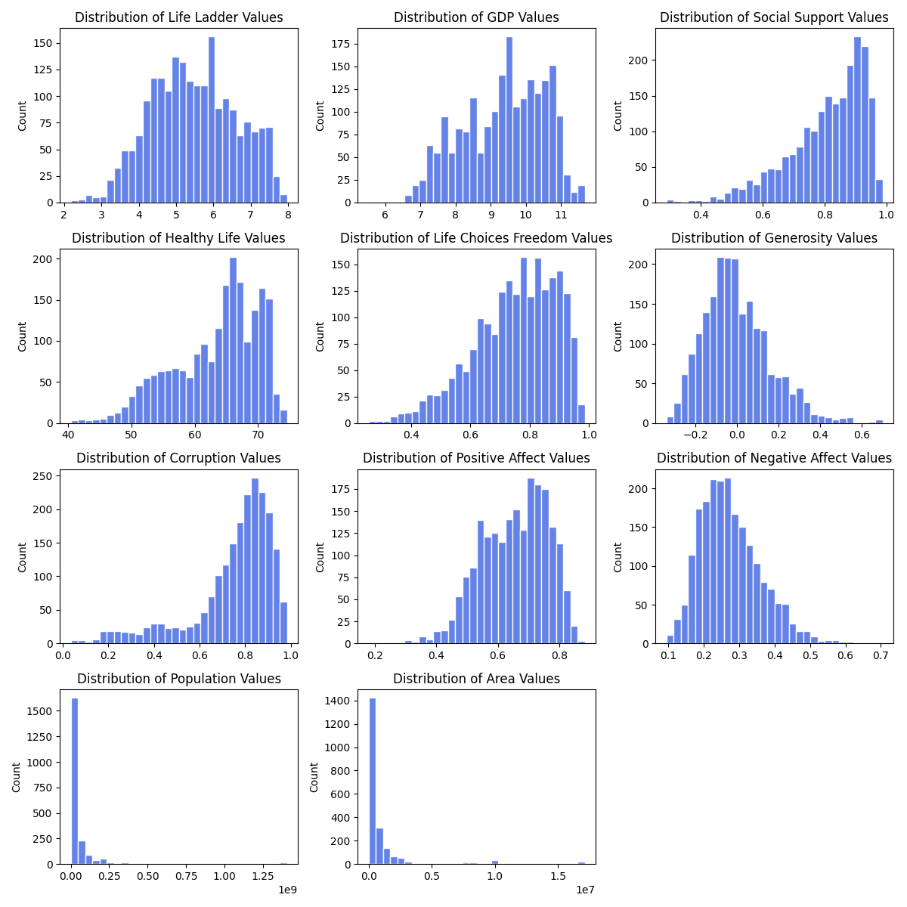

# Exploratory Data Analysis

### Distribution Characteristics
[Life Ladder](results/eda/life_ladder.txt)  
[Log GDP per capita](results/eda/gdp.txt)  
[Social support](results/eda/social_support.txt)  
[Healthy life expectancy at birth](results/eda/healthy_life.txt)  
[Freedom to make life choices](results/eda/life_choices_freedom.txt)  
[Generosity](results/eda/generosity.txt)  
[Perceptions of corruption](results/eda/corruption.txt)  
[Positive affect](results/eda/positive_affect.txt)  
[Negative affect](results/eda/negative_affect.txt)  
[Population](results/eda/population.txt)  
[Area](results/eda/area.txt)  

